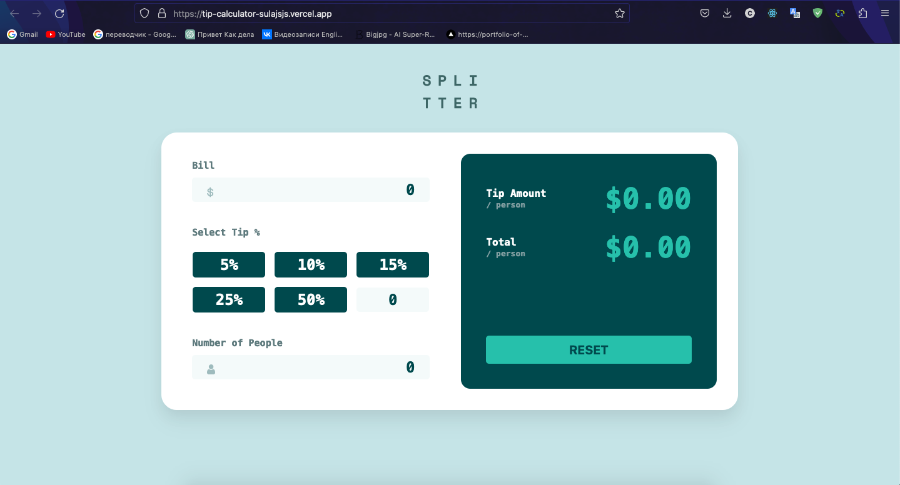

# Frontend Mentor - Tip calculator app solution

---

This is a solution to the [Tip calculator app challenge on Frontend Mentor](https://www.frontendmentor.io/challenges/tip-calculator-app-ugJNGbJUX). Frontend Mentor challenges help you improve your coding skills by building realistic projects.

---

## Table of contents

- [Overview](#overview)
  - [The challenge](#the-challenge)
  - [Screenshot](#screenshot)
- [My process](#my-process)
  - [Built with](#built-with)
- [Author](#author)
- [Run project](#how-to-run-this-project)

---

## Overview

### The challenge

Users should be able to:

- View the optimal layout for the app depending on their device's screen size
- See hover states for all interactive elements on the page
- Calculate the correct tip and total cost of the bill per person

---

## My process

### Built with

- HTML5
- SCSS - for styling
- EsLint / Prettier - for code quality
- React - JavaScript library
- Vite for development Speed
- TypeScript - for add type safety to the project

---

### Screenshot

---

## Author

- Website - [Portfolio](https://sula-portfolio.netlify.app/)
- LinkedIn - [link](https://www.linkedin.com/in/osmonov-sultan-a049a5240/)

---

## How to run this project

---

npm install

npm run dev
